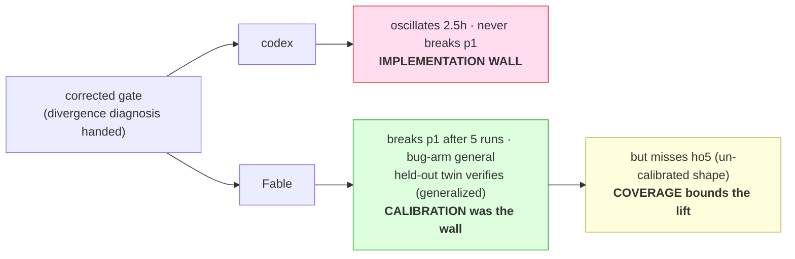
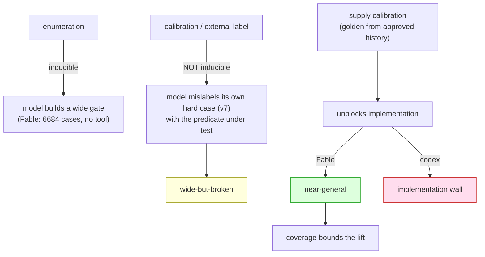

# Results

Visual dashboard for the headline case (verus #2219). Argument → [README](README.md) · Lessons → [LESSONS.md](LESSONS.md) · Reproduce → [REPRODUCE.md](REPRODUCE.md) · Raw data → [`pilots/11-verus-2219/`](pilots/11-verus-2219/) ([manifest](pilots/11-verus-2219/MANIFEST.md)).

The bug: a verifier soundness hole whose correct fix is an **XOR-shaped predicate** — flip the *uninhabited-ghost* case (the bug) without touching *genuine divergence* (sound). Narrow fixes get the first arm; only the second arm separates a real fix from a plausible-but-wrong one.

---

## The arc, at a glance

What lifts a model from a narrow patch toward a general fix — and where each lever stops.

| stage | codex `gpt-5.5` (CLI) | Fable `claude-fable-5` (headless) |
|---|---|---|
| prompt methods — 6 × 3 draws | 🔴 narrow (`changed=114`, 0/18 general) | 🔴 narrow ≈ strong prompt (no lift from method) |
| model alone (`minimal_v3`, prompt held constant) | 🔴 narrow (114) | 🟠 **wide-but-broken** (269) — *model lift* |
| + `case-check` tool (execution-gated) | 🟠 wide-but-broken (269) | — |
| + corrected gate (**calibration handed**) | 🔴 **C — oscillates**, implementation wall | 🟢 **near-A — breaks through**, calibration was the wall |
| human maintainer [`#2501`] | 🟢 general + correct | 🟢 general + correct |

**Legend** 🔴 narrow / stalls · 🟠 general on the bug arm but **over-rejects divergence** · 🟢 clears the divergence arm (within coverage)

---

## The decisive cell: the families split

Same divergence diagnosis handed to both models. One can implement the discriminator, the other can't.

→ codex's wall is **implementation** (calibration doesn't remove it); Fable's was **calibration** (supply it and implementation follows). A genuine model-capability difference, isolated on the discriminator itself — not just the bug arm. Patches: [`gate2_codex_terminated`](pilots/11-verus-2219/patches/gate2_codex_terminated.patch) (C, [oscillation proof](worklog/WORK_LOG.md)) · [`fable_gate2`](pilots/11-verus-2219/patches/fable_gate2.patch) (near-A, [trace analysis](worklog/FABLE_WORKLOG.md)).

---

## Four families: the wall is not universal — and it isn't leakage

The corrected-gate arm, run on two more families (2026-06-13). Every verdict is a forced-fresh independent grade (calibrated case-check + `p1`/`p2` preserve + sealed held-outs the model never saw).

| family | harness | contamination | impl wall (`p1`/`p2`) | sealed (`proofdiv`/`exec`) | `ho5` | outcome |
|---|---|---|:--:|:--:|:--:|---|
| codex `gpt-5.5` | codex-CLI | clean | ❌ oscillates 2.5h | — | — | 🔴 **C** (impl wall) |
| Fable `claude-fable-5` | claude-headless | **clean** (Jan 2026) | ✅ / ✅ | V / V | ❌R | 🟢 near-A |
| Composer 2.5 | cursor-agent | *not clean* (ships May 2026) | ✅ / ✅ | V / V | ❌R | 🟢 near-A |
| Sonnet 4.6 | claude-headless | **clean** (Feb 2026 release) | ✅ / ✅ | V / V | ❌R | 🟢 near-A |

Three of four families clear the wall to **near-A**, all with the *same* `requires_false`/declared-`!` carve-out and the *same* `ho5` residual. Only codex oscillated → its Outcome C is **model/harness-specific, not a universal wall**.

**On leakage.** Composer 2.5 cleared the wall but isn't contamination-clean (it shipped *after* the fix and Cursor attests no cutoff), so its pass could be capability *or* recall. It is not recall: **two contamination-clean models — Fable and Sonnet 4.6 — independently reach the identical fix-class and the identical single failure.** Once a clean model demonstrably reaches the predicate, leakage is no longer *needed* to explain a dirty model reaching it too. The clean+dirty convergence on one carve-out and one shared `ho5` miss is a property of the gate+task, not memorization. (Efficiency does differ: Composer ~1h; Sonnet needed a second fair run after a 3h truncation.)

---

## The thesis in one diagram

**Enumeration is inducible; calibration is not.** A model can build itself a wide net but not an external oracle, because the correct label *is* the disputed predicate ([the `v7` self-mislabel](worklog/FABLE_WORKLOG.md)). Hand it the label and implementation unblocks — model-dependently — but only as far as the gate's coverage reaches.

---

## The verus #2219 battery

Forced-fresh, identity-verified builds ([why that matters](LESSONS.md)). **Bug** probes must REJECT; **divergence** probes must VERIFY.

| arm | t1 | t2 | h2 (×2) | t3 | ho5 | case-check | bucket | artifacts |
|---|:--:|:--:|:--:|:--:|:--:|---|---|---|
| base (buggy) | V | V | V · V | V | V | `pass=false` | bug present | — |
| #2230 narrow (maintainer) | R | V | — | V | V | `changed=114` | narrow | — |
| codex prompts (best) | R | V | V · V | V | V | `changed≤114` | 🔴 narrow | [patches](pilots/11-verus-2219/patches/) |
| Fable, model alone | R | R | R · R | ❌R | ❌R | `pass=true, 269` | 🟠 wide-but-broken | [`fable_arm`](pilots/11-verus-2219/patches/fable_arm.patch) |
| codex + case-check | R | R | R · R | ❌R | ❌R | `pass=true, 269` | 🟠 wide-but-broken | [`casecheck_pilot`](pilots/11-verus-2219/patches/casecheck_pilot.patch) |
| codex + corrected gate | — oscillates, never stable — | | | | | (C) | 🔴 impl wall | [`gate2_codex…`](pilots/11-verus-2219/patches/gate2_codex_terminated.patch) |
| **Fable + corrected gate** | R | R | R · R | ✅**V** | ❌R | `pass=true, 269` | 🟢 **near-A** | [`fable_gate2`](pilots/11-verus-2219/patches/fable_gate2.patch) |
| **Composer 2.5 + corrected gate** | R | R | R · R | ✅**V** | ❌R | `pass=true, 0 mis` | 🟢 **near-A** | [`composer_gate2`](pilots/11-verus-2219/patches/composer_gate2.patch) |
| **Sonnet 4.6 + corrected gate** | R | R | R · R | ✅**V** | ❌R | `pass=true, 0 mis` | 🟢 **near-A** | [`sonnet_gate2_run2`](pilots/11-verus-2219/patches/sonnet_gate2_run2.patch) |
| #2501 general (maintainer) | R | R | R · R | ✅V | (V) | `mishandles=0` | 🟢 general+correct | — |

`✅`/`❌` mark where the divergence arm is cleared vs over-rejected. The whole study turns on the `t3`/`ho5` columns: every automated arm gets the bug columns; only Fable-with-calibration clears `t3`, and nothing automated clears `ho5`.

Full provenance-stamped rows: [`clean_dataset.md`](pilots/11-verus-2219/clean_dataset.md) · [`.jsonl`](pilots/11-verus-2219/clean_dataset.jsonl).

---

## Navigate (agents & humans)

| you want… | go to |
|---|---|
| the distilled findings + method lessons | [LESSONS.md](LESSONS.md) |
| to reproduce (with the 5 traps) | [REPRODUCE.md](REPRODUCE.md) · [pilot runbook](pilots/11-verus-2219/REPRODUCE.md) |
| every patch, by arm | [`patches/`](pilots/11-verus-2219/patches/) ([map](pilots/11-verus-2219/MANIFEST.md)) |
| the model session traces | [`logs/`](pilots/11-verus-2219/logs/) · [FABLE_WORKLOG](worklog/FABLE_WORKLOG.md) |
| the gate (enumeration + calibration) | [`tools/case-check.py`](pilots/11-verus-2219/tools/case-check.py) · [`gate2/`](pilots/11-verus-2219/gate2/) |
| the held-outs (outside the gate) | [`oracle/`](pilots/11-verus-2219/oracle/) · [`heldout2/`](pilots/11-verus-2219/heldout2/) · [`gate2/sealed/`](pilots/11-verus-2219/gate2/sealed/) |
| the mechanism dissection + corrections | [MECHANISM-dissection.md](pilots/11-verus-2219/MECHANISM-dissection.md) · [RESULT-corrected.md](pilots/11-verus-2219/RESULT-corrected.md) |
| the tool, generalized | [github.com/kimjune01/abductor](https://github.com/kimjune01/abductor) |

---

*Caveats carried throughout: n=1 per cell, model+harness (not pure weights), and "lift" means narrow→wider, not narrow→correct. The divergence arm is cleared unaided only by the human maintainer. See [LESSONS.md](LESSONS.md) for the full threat list.*
